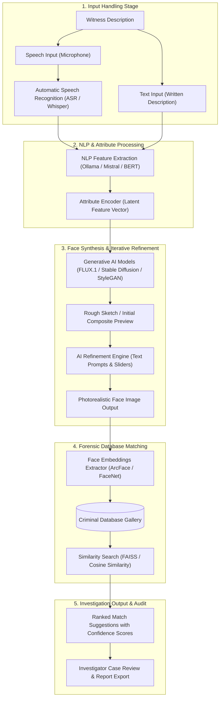
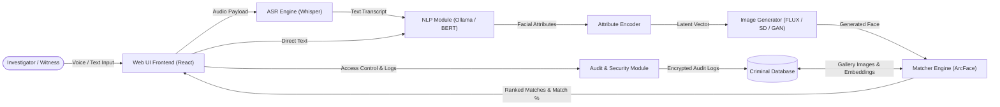
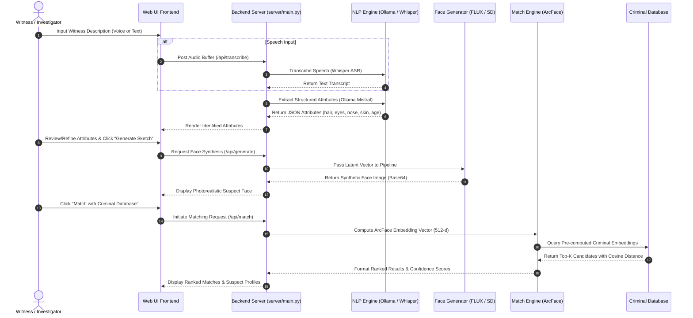
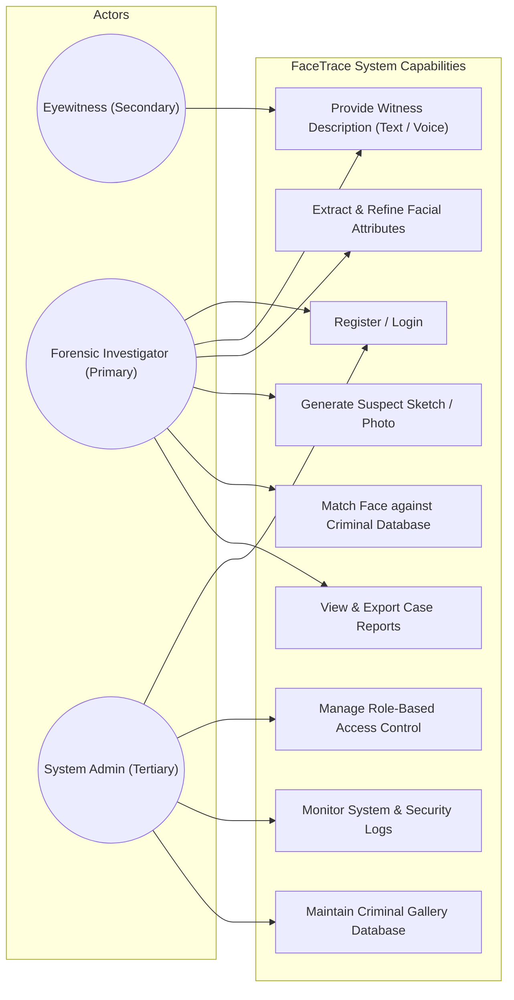
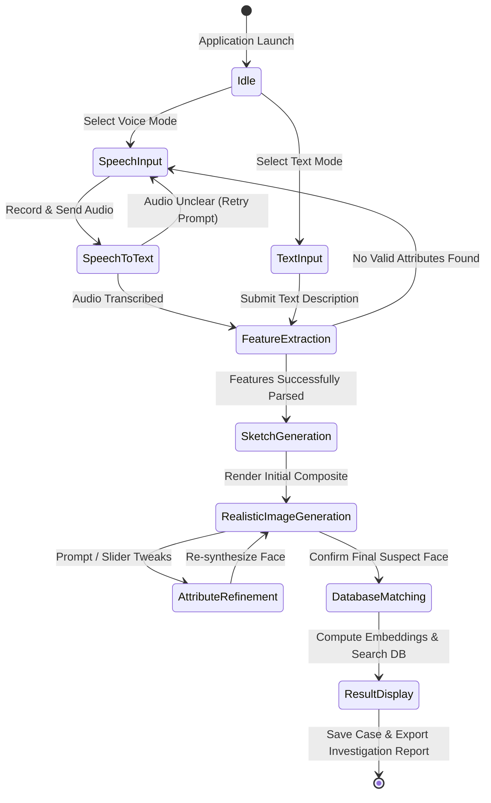
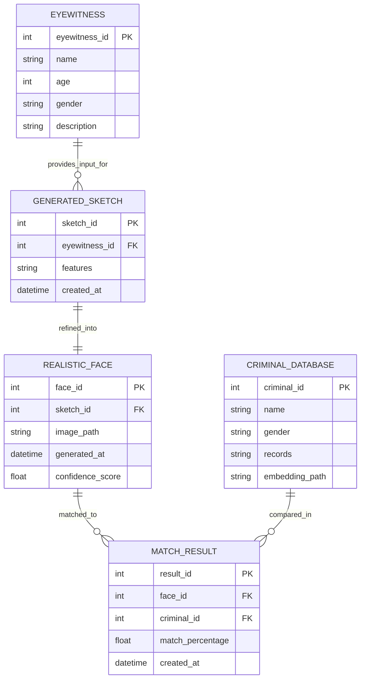
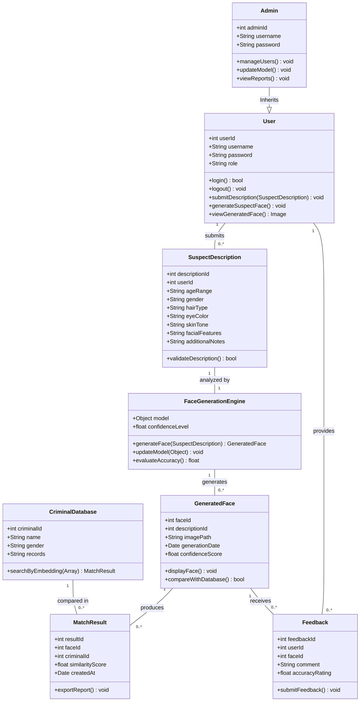

# FaceTrace: AI-Driven Suspect Sketch & Photorealistic Face Creator


**FaceTrace** is an advanced AI-powered forensic system designed to convert verbal or textual witness descriptions into photorealistic facial images of suspects and automatically match them against law enforcement criminal databases. By combining Automatic Speech Recognition (ASR), Natural Language Processing (NLP), Generative Adversarial Networks (GANs) / Diffusion Models, and Deep Face Recognition embeddings, FaceTrace drastically reduces reliance on traditional manual sketch artists and accelerates investigative workflows.

---

## 📚 Project Documentation & References

- **Full SRS & SDD Documentation (Google Drive)**: [FaceTrace Documentation Folder](https://drive.google.com/drive/folders/1Gg-lUnFcmE60WEJxYqWy1vV19S4Zmk7N?usp=sharing)
- **Software Requirement Specification (SRS)**: Formally defines functional/non-functional requirements, acceptance criteria, performance metrics, and user interfaces.
- **Software Design Description (SDD)**: Outlines high-level architecture, low-level UML analysis/design models (sequence, state transition, collaboration, class diagrams), and complete ER database schemas.

---

## 🔄 System Architecture & Workflows

### 1. High-Level System Workflow Diagram
The following flowchart illustrates the linear, 5-stage pipeline transforming witness testimony into actionable suspect identification:



---

### 2. Collaboration & Component Data-Flow Diagram
Illustrates how independent system modules (Frontend, ASR, NLP Engine, Latent Encoder, Generator, Matcher, Security Audit) communicate seamlessly:



---

### 3. End-to-End Sequence Diagram (Analysis Model)
Detailed message flow across components during witness interaction, facial feature extraction, face synthesis, and database matching:



---

### 4. System Use Case Diagram
Maps the roles and operational permissions for Eyewitnesses, Forensic Investigators, and System Administrators:



---

### 5. State Transition Diagram
Represents the operational state lifecycle of the system during an investigative session:



---

### 6. Entity-Relationship (ER) Database Model
The relational database schema for managing eyewitness input, generated sketches, realistic faces, criminal galleries, and match logs:



---

### 7. Software Class Diagram (Low-Level Design)
Represents the static structure, object attributes, methods, and relationships of the software components:



---

## 🛠️ Tech Stack & Architecture

- **Frontend**: React 18, HTML5, CSS3 / Custom Design System, Electron integration.
- **Backend Service**: Python Flask (`server/main.py`), PyTorch, CUDA acceleration.
- **Speech Recognition (ASR)**: OpenAI Whisper (`faster-whisper`).
- **NLP Feature Extraction**: Local Ollama LLM (`mistral` model) & HuggingFace Transformers.
- **Generative AI Models**: `black-forest-labs/FLUX.1-schnell`, Stable Diffusion Inpainting, StyleGAN / Pix2Pix baselines.
- **Face Recognition & Matching**: DeepFace framework, ArcFace model embeddings (`retinaface` backend), FAISS / Cosine Similarity distance metrics.
- **Authentication & Database**: Firebase Auth, Firestore, Encrypted Local/Cloud Storage.

---

## 🚀 Quick Start Guide

### Prerequisites

- **Python 3.10+**
- **Node.js 18+** & `npm`
- **Git**
- **Ollama** (for local LLM extraction)
- *(Optional)* NVIDIA GPU with CUDA drivers & FFmpeg in `PATH`

---

### Windows Setup Instructions

1. **Clone the Repository & Navigate to Folder**:
   ```powershell
   git clone <your-repo-url>
   cd forensic_sketch_final
   ```

2. **Create & Activate Virtual Environment**:
   ```powershell
   python -m venv venv
   .\venv\Scripts\Activate.ps1
   ```

3. **Install Dependencies**:
   ```powershell
   python -m pip install --upgrade pip
   pip install -r requirements.txt
   npm install
   ```

4. **Environment Variables**:
   Create a `.env` file in the root directory:
   ```env
   HF_TOKEN=your_huggingface_token_here
   ```

5. **Start Ollama & Pull Model**:
   ```powershell
   ollama pull mistral
   ```

---

### Running the Application

#### Option 1: One-Click Windows Launcher (Recommended)
Double-click or run from Command Prompt/PowerShell:
```bat
run.bat
```
This script automatically validates python/node environments, installs missing dependencies, launches the Flask backend (`server/main.py`), and starts the React frontend.

#### Option 2: Manual Start
- **Terminal 1 (Backend)**:
  ```powershell
  python server/main.py
  ```
  *(Runs on `http://127.0.0.1:5000`)*

- **Terminal 2 (Frontend)**:
  ```powershell
  npm start
  ```
  *(Runs on `http://localhost:3000`)*

---

## 📦 Local FLUX Model Setup (Optional)

To enable offline high-resolution image generation with `FLUX.1-schnell`:
1. Accept model terms on [Hugging Face FLUX.1-schnell](https://huggingface.co/black-forest-labs/FLUX.1-schnell).
2. Set your `HF_TOKEN` in `.env`.
3. Run the model downloader:
   ```bat
   download_model.bat
   ```
*(Requires ~23 GB disk space).*

---

## ❓ Troubleshooting

- **Ollama Connection Error**: Ensure the Ollama background service is active and `ollama pull mistral` has completed.
- **PowerShell Script Execution Policy**: Run `Set-ExecutionPolicy -Scope Process -ExecutionPolicy Bypass` if venv activation is blocked.
- **CUDA / Out of Memory**: The system gracefully falls back to CPU or Hugging Face Inference API if CUDA GPU memory is insufficient.

---

## 📄 License & Citation
Refer to academic publications cited in the SRS/SDD documentation for model baseline details (ArcFace, StackGAN++, Text-Guided Sketch-to-Photo).
